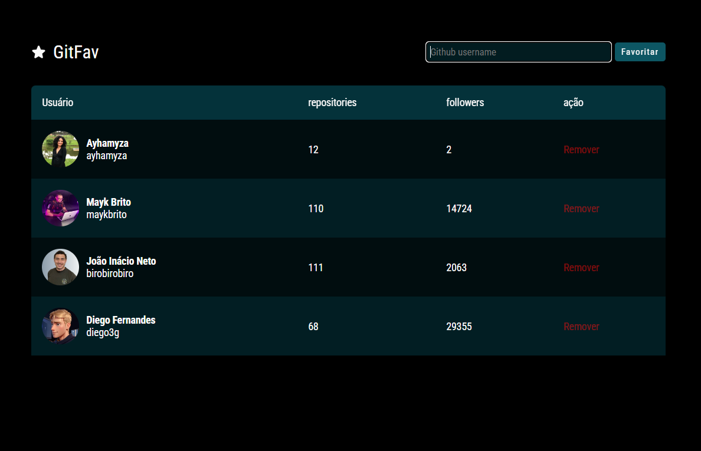

<h1 align="center"> GitFav </h1>

  <a href="#-tecnologias">Tecnologias</a>&nbsp;&nbsp;&nbsp;|&nbsp;&nbsp;&nbsp;
  <a href="#-projeto">Projeto</a>&nbsp;&nbsp;&nbsp;|&nbsp;&nbsp;&nbsp;

 

  

## 🚀 Tecnologias

Esse projeto foi desenvolvido com as seguintes tecnologias:

- HTML e CSS
- JavaScript
- Git e Github
- Figma
- Json
- Node.Js
- integração com API do GitHub 

## 💻 Projeto

O GitFav é uma aplicação que permite aos usuários explorar perfis do GitHub e salvar seus favoritos. 

- [Acesse o projeto finalizado, online](https://ayhamyza.github.io/GitFav/)